# 策略规则系统业务执行模型

本文档描述当前 RulesConfig 这套系统在业务上的抽象方式与执行模型，用于后续功能设计、UI 调整、类型定义收敛和引擎实现对齐。

## 1. 系统定位

这不是一套简单的 if-else 规则配置器，而是一套面向大型复杂仓库的策略编排系统。

它服务于 WMS 的多个核心作业域，包括但不限于：
- 收货（Receiving）
- 上架（Putaway）
- 分配（Allocation）
- 波次（Wave）
- 补货（Replenishment）

系统目标不是配置单条规则，而是配置一整套可执行、可组合、可分流、可评分、可验证的仓储决策体系。

## 2. 核心设计思想

这套系统采用混合模式策略编排，不属于单一的规则执行范式。

### 2.1 总体架构图

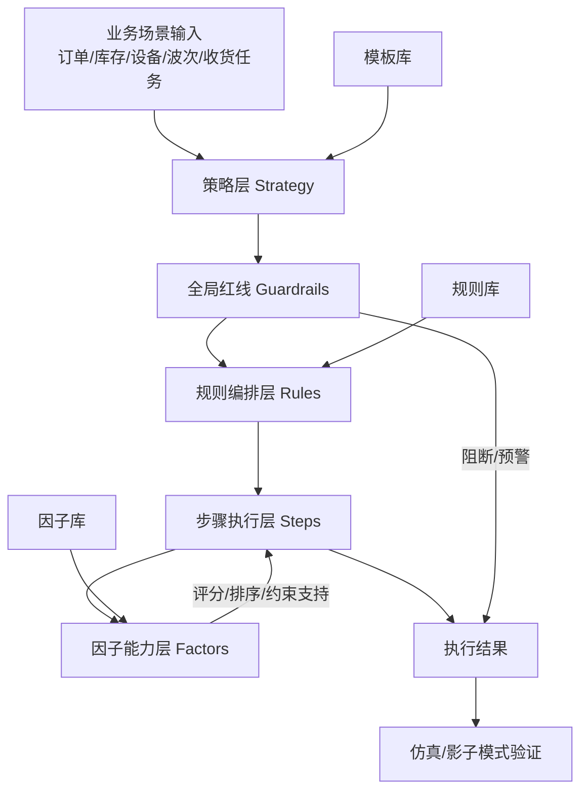

### 2.2 分层职责图

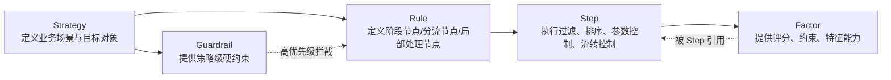

它同时支持以下几类决策机制：
- 优先级/准入拦截
- 多阶段串行流水线
- 条件分支跳转
- 因子驱动的评分寻优
- 全局红线约束
- 仿真与影子模式验证

因此，这个系统更接近“仓储决策编排中枢”，而不是传统的“规则编辑器”。

## 3. 顶层业务对象

## 3.1 Strategy：策略

策略是面向业务场景的顶层容器。

一个策略通常表达：
- 当前解决的是哪个作业域问题
- 服务于哪类业务场景
- 最终要对哪个业务对象做决策
- 该策略下包含哪些规则节点与约束

策略是“场景级”决策入口，而不是单条执行语句。

例如：
- 面向门店补货的库存分配策略
- 面向冷链商品的上架策略
- 面向高峰订单池的波次聚类策略

## 3.2 Rule：规则节点

规则是策略内部的编排节点。

规则不是单纯的一行条件，而是一个可参与执行链路的决策单元。它可以承担多种职责：
- 规则准入
- 维度处理
- 流程分流
- 阶段编排
- 局部寻优

一个策略通常由多个规则组成，这些规则之间可能是：
- 串行衔接
- 分组执行
- 命中即停
- 条件跳转
- 网关分支

因此，规则的本质更像“执行节点”，而不是“条件项”。

## 3.3 Step：步骤

步骤是规则内部的最小执行单元。

每个规则可以由多个步骤组成，用来表达更细粒度的处理过程。步骤通常承载：
- 筛选候选集
- 选择评分维度
- 设置权重
- 控制流转方式
- 配置私有参数

Step 是规则语义真正落地的地方。

一个规则可以只有一个 step，也可以拆成多个 step 串联执行，分别承担不同阶段职责，例如：
- 第一步：合规过滤
- 第二步：效率评分
- 第三步：失败兜底或拆分执行

### 3.3.1 与编程模型的类比

如果把这套系统类比成程序结构，可以这样理解：

- Strategy 像一个 module / service / workflow entry
  - 定义处理哪个业务场景
- Rule 像一个 function 或一个大的代码块
  - 负责一个阶段性的业务处理任务
- Gateway Rule 像 `if / else`、`switch`、`match`
  - 负责控制流分支，而不是直接做业务处理
- Step 像一条或一组可执行语句
  - 真正承载过滤、选择、转换、指派、锁定、释放等执行逻辑
- action 像语句的操作码或函数调用意图
  - `VALIDATE` 像校验语句
  - `SELECT` 像选优语句
  - `ASSIGN` 像绑定或指派调用
  - `ROUTE` 像生成下一跳
  - `LOCK` 像加锁动作

用这个类比看，规则节点 / 路由节点 属于“控制结构层”，而 step + action 属于“执行语句层”。

因此，动作不应该再被提升成和规则节点、路由节点同级的新节点类型；否则就等于把“函数 / if-switch”和“赋值语句 / 调用语句”放到同一抽象层，会让模型和管理设计都变得混乱。

一个更贴切的结构是：

```text
Strategy
└── Rule Node A
    ├── Step 1: VALIDATE ORDER_LINE -> ORDER_LINE
    ├── Step 2: SELECT INVENTORY_LOT -> INVENTORY_LOT
    └── Step 3: ASSIGN ORDER_LINE -> LOCATION
└── Gateway Node B
    ├── branch: VIP
    └── branch: NORMAL
```

它可以类比为：

```ts
function inboundStrategy() {
  validateOrderLine();
  selectInventoryLot();
  assignLocation();

  if (isVip()) {
    runVipBranch();
  } else {
    runNormalBranch();
  }
}
```

这个类比有一个直接结论：
- 如果负责“流程怎么走” → 节点级
- 如果负责“这一步做什么” → 步骤级

所以动作更适合作为 Step 的显式语义字段，而不是新的节点层级。

## 3.4 Factor：因子

因子是系统中的可复用决策能力单元。

因子不是规则本身，而是为规则提供度量、约束、评分基础的“能力资产”。

一个因子通常定义：
- 度量哪个目标对象
- 计算逻辑是什么
- 属于约束类、调节类还是行为类影响
- 结果如何参与筛选或排序

因子的价值在于：
- 统一沉淀业务经验
- 在不同策略、规则、步骤中复用
- 支撑评分型寻优，而不是把逻辑写死在页面里

可以把因子理解为策略引擎的“特征库”或“度量库”。

## 3.5 Guardrail：全局红线

红线是高优先级、跨规则、跨步骤的系统级约束。

它的职责不是提升命中率，而是进行强约束控制，用于保障：
- 合规性
- 安全性
- 资源保护
- 风险拦截

红线通常位于局部策略之前，优先于普通规则执行。

典型例子：
- 温区非法匹配时禁止分配
- 临期品低于阈值时直接阻断流转
- WIP 超限时阻断波次继续释放

它们属于“不能被局部优化覆盖”的硬约束。

## 4. 业务执行模型

从业务抽象上，这套系统的执行顺序应理解为如下结构。

### 4.1 执行主流程图

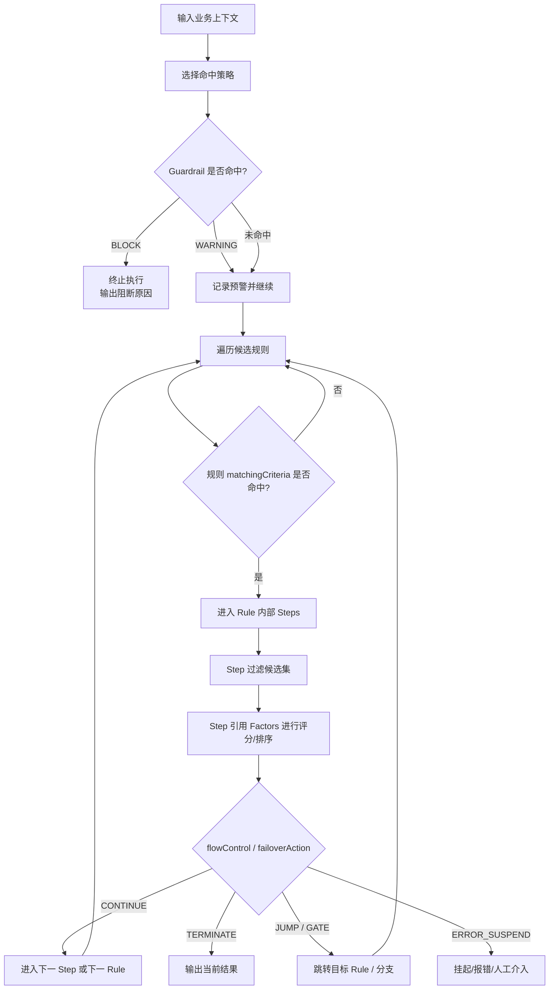

### 4.2 评分寻优子流程图


### 阶段 1：选择场景策略

系统先确定当前命中的策略。

这一层决定：
- 当前处于哪个业务域
- 最终优化目标是谁
- 后续规则链应该如何组织

这一步是业务上下文定位，不是细节执行。

### 阶段 2：全局红线校验

策略一旦被选中，应优先执行与该策略绑定的全局红线。

目标是先回答两个问题：
- 当前业务是否允许继续执行
- 当前场景是否需要风险提示或强制拦截

这里的结果通常分为：
- 允许继续
- 预警继续
- 硬阻断终止

### 阶段 3：规则级命中判断

进入策略后，系统不是无脑执行所有规则，而是先根据规则本身的匹配条件判断：
- 当前业务上下文是否适用于这条规则
- 当前订单、货物、设备、波次、载具等是否满足规则准入

这一层的作用是缩小规则执行范围。

### 阶段 4：步骤级处理

规则被命中后，内部多个 step 开始执行。

每个 step 都可能承担不同职责：
- 过滤：排除不合格候选集
- 打分：对候选项进行加权排序
- 限制：附加局部参数限制
- 引导：决定继续流转还是终止
- 降级：当候选不足时触发兜底动作

这一步是整个策略执行的核心。

### 阶段 5：流控与分支

在 step 结束后，系统需要根据配置继续决定流程行为。

常见处理包括：
- 命中后终止
- 命中后继续到下一 step
- 当前规则结束后进入下一规则组
- 根据条件跳转到目标规则
- 在网关结构下走不同 branch
- 因失败而报错、挂起或拆分新任务

也就是说，这套系统不是纯线性的，它天然允许存在流程树和跳转链。

### 阶段 6：输出结果

最终输出可能不是单一值，而是一组结构化结果，例如：
- 最优库位推荐
- 最优库存批次推荐
- 最优波次分组
- 最优任务分派对象
- 不可执行原因
- 风险告警信息
- 执行路径追踪

## 5. 混合模式的具体含义

系统之所以被定义为混合模式，是因为它融合了四种不同风格的执行语义。

### 5.0 典型业务场景链路图

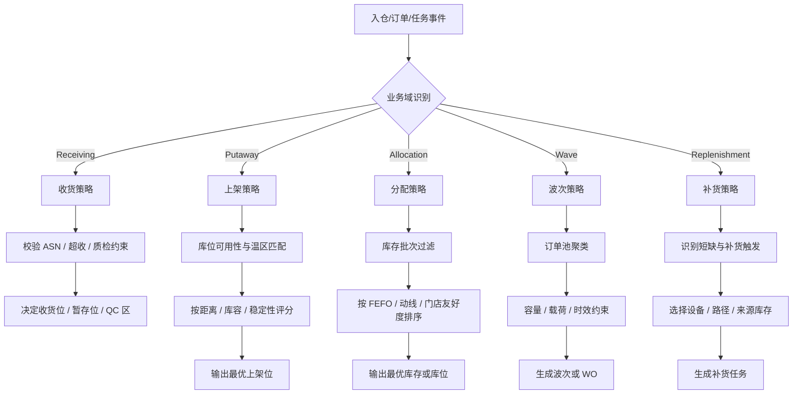

### 5.0.1 大型复杂仓库决策特征图

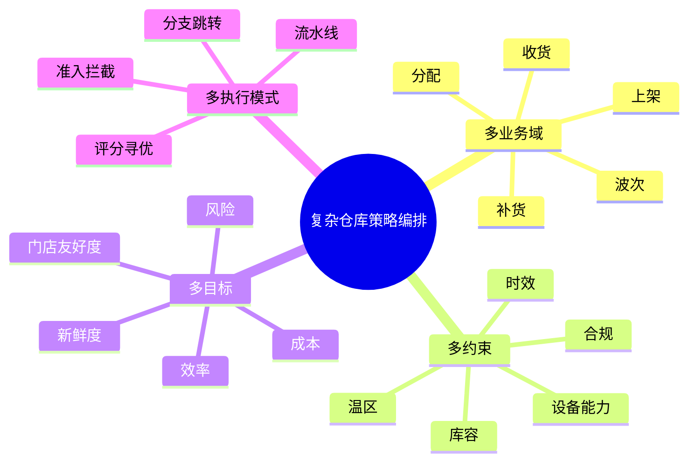

### 5.1 准入式规则

这类规则的重点是“能不能进”。

核心目标：
- 先把不符合基本要求的对象挡掉
- 对候选空间做硬收敛

例如：
- 温区不符禁止进入
- 无拣选面禁止收货
- 载具类型不符禁止流转

### 5.2 流水线规则

这类规则强调分阶段执行。

核心目标：
- 把复杂逻辑拆成多个步骤串联
- 每一步只处理一部分问题
- 支持逐级增强和逐级降级

例如：
- 先做合规过滤
- 再做效率计算
- 再做承载平衡
- 最后做失败兜底

### 5.3 分支/跳转规则

这类规则强调结构化流程控制。

核心目标：
- 根据业务条件决定走不同路径
- 让策略支持复杂仓库中的异构作业链路

例如：
- B2B 与 B2C 分开走
- ASN 与退货单走不同路径
- 满托与零散库存进入不同处理分支

### 5.4 评分寻优规则

这类规则强调“候选不止一个时如何选最优”。

核心目标：
- 在多个可行候选中做综合权衡
- 使用因子和权重形成有解释性的推荐结果

例如：
- FEFO 权重 80% + 清库倾向 20%
- 路径距离 50% + 门店陈列顺序 30% + 货重等级 20%

这是大型复杂仓库最关键的能力之一，因为很多问题不是“能不能做”，而是“多个都能做时怎么选得最好”。

## 6. 因子驱动模型

因子在这套系统里应被视为核心资产层，而不是附属配置。

因子驱动的价值有四点：
- 把经验规则从具体策略中抽离
- 支持跨策略复用
- 支持评分逻辑透明化
- 支持未来从静态规则过渡到更高级的算法配置

因此，策略规则系统不是：
- 直接写死 if A then B

而是：
- 定义候选范围
- 提供多个可量化因子
- 设定权重和方向
- 输出可解释的结果排序

这使得系统天然适合承载更复杂的仓储逻辑。

## 7. 大型复杂仓库场景下的意义

在大型复杂仓库中，真实业务往往具备这些特征：
- 多温层
- 多货主
- 多履约模式
- 多设备协同
- 多作业波段
- 高峰与平峰切换
- 自动化设备与人工混合作业
- 合规要求与效率要求并存

因此，系统不能只支持“单规则命中”。

它必须支持：
- 多条件联合
- 多阶段递进
- 多目标权衡
- 多路径分流
- 局部失败降级
- 全局风险约束

这也是为什么这套系统的正确定位不是“规则编辑器”，而是“复杂仓储决策编排平台”。

## 8. UI 与执行模型的对应关系

当前前端结构已经基本反映了这套执行思想。

### 8.1 产品工作台关系图

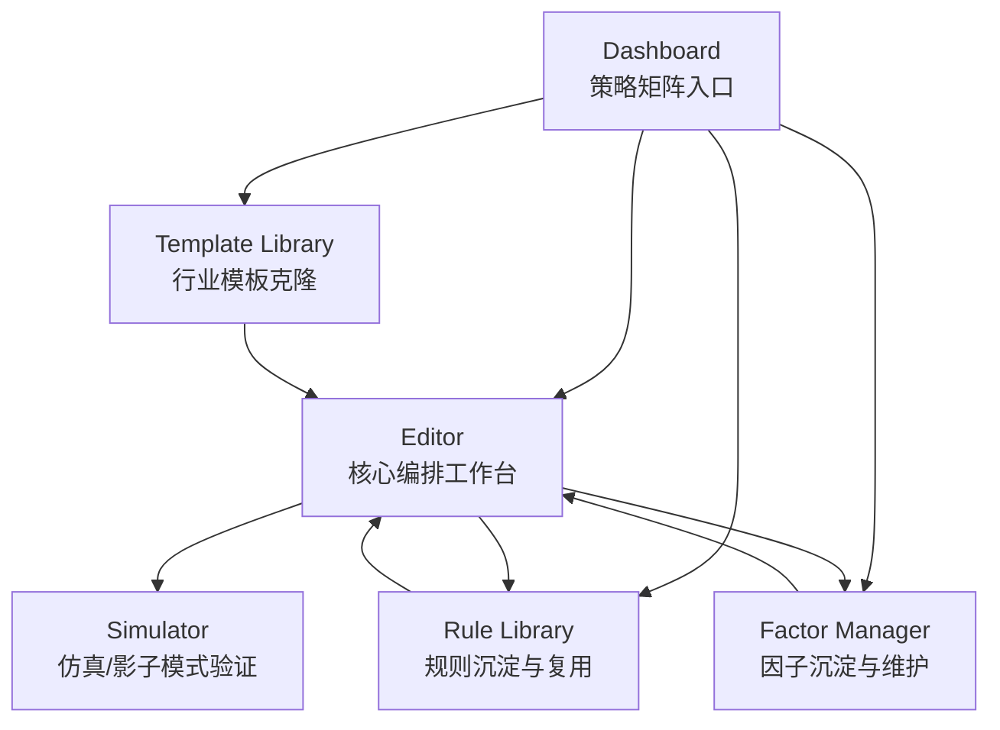

### 8.2 核心对象关系图

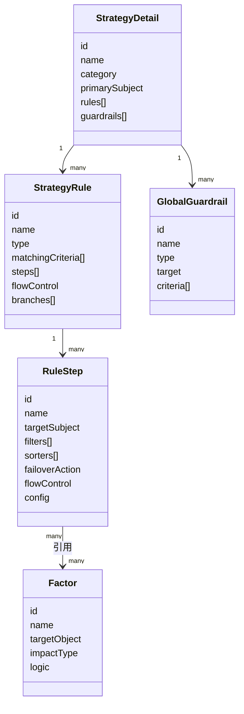

- Dashboard：看策略矩阵，决定管理哪个场景策略
- Editor：编排规则、步骤、因子和流控关系，是核心工作台
- Rule Library：沉淀规则节点，支持跨场景复用
- Factor Manager：沉淀因子能力，支持评分与约束抽象
- Template Library：沉淀行业最佳实践模板
- Simulator：验证策略逻辑、观察过滤漏斗、查看推荐与告警结果

从产品结构上看，这些页面不是孤立模块，而是围绕同一套执行模型展开的不同工作入口。

## 9. 后续设计和实现时应坚持的原则

### 9.0 关键建模补充：输入主体、输出主体与动作语义

当前模型已经具备“策略 -> 规则 -> 步骤 -> 因子”的基本结构，但对于大型复杂仓库来说，仍存在一个关键缺口：

一个规则或一个步骤，不一定始终围绕同一个业务对象工作。

实际业务中经常出现以下对象迁移：
- 从 `ORDER_LINE` 出发筛选 `INVENTORY_LOT`
- 从 `INVENTORY_LOT` 继续选择最优 `LOCATION`
- 从 `LOCATION` 派生出 `TASK`
- 将 `TASK` 再分配给 `EQUIPMENT` 或 `OPERATOR`

这意味着 Step 的职责不只是“过滤候选项”，还包括：
- 当前在处理谁
- 产出的对象是谁
- 对产出对象要做什么动作

如果只保留单一 `targetSubject`，会导致以下问题：
- 无法准确表达对象在步骤之间的迁移
- 无法清楚表达步骤输出的业务结果
- 正常业务动作与失败兜底动作容易混在一起
- 后续接入真实执行引擎、审计链路和回放系统时会很吃力

因此，建议将 Step 从“筛选单元”升级为“决策操作单元”。

### 9.0.1 推荐的 Step 建模方式

推荐把一个 Step 明确建模为五部分：

1. 主输入主体：当前步骤主要处理的对象是谁
2. 上游依赖输入：当前步骤还依赖哪些前序步骤的输出结果
3. 输出主体：当前步骤产出的对象是谁
4. 决策方式：通过哪些过滤、评分、排序、映射规则得到结果
5. 动作行为：得到输出对象后要执行什么业务动作

可抽象为：
- 我当前主要在处理谁？
- 我还要引用前面哪些步骤的结果？
- 我产出谁？
- 我是怎么决定的？
- 我决定后做什么？

这里需要特别强调：
- `inputSubject` 适合表达“主输入主体”
- 但真实业务中，一个步骤经常还会引用前面一个或多个步骤的输出
- 这些上游结果不应与主输入主体混成同一个字段

例如分配步骤里：
- 主输入主体可能是 `ORDER_LINE`
- 但同时还要引用“需求预处理步骤”产出的需求上下文
- 以及“库存查找步骤”产出的 `INVENTORY_LOT` 候选集

因此，不建议简单把 Step 建模成“多个并列 inputSubject”。
更合适的方式是：
- 保留一个主输入主体字段
- 另外增加一组“上游依赖绑定”字段，专门表达该步骤依赖哪些前序结果以及这些结果在当前步骤里的角色

### 9.0.2 建议增加的核心字段

在现有 `RuleStep` 基础上，建议逐步增加：
- `stepType`：步骤类型
- `inputSubject`：主输入主体
- `upstreamBindings`：上游依赖输入绑定
- `outputSubject`：输出主体
- `action`：业务动作
- `selectionMode`：候选输出模式
- `outputMapping`：输入到输出的映射配置

### 9.0.3 推荐的步骤类型

建议步骤类型至少支持：
- `FILTER`：过滤型步骤
- `SELECT`：选择/评分寻优型步骤
- `TRANSFORM`：对象转换型步骤
- `GATEWAY`：分支/网关型步骤

这里的 `stepType` 只表达“这一步怎么决策/怎么处理”，不再单独保留 `ACTION` 作为步骤类型。
正常业务动作统一通过 `action` 字段表达，因此每一种步骤类型都可以带动作语义。
- 不同步骤类型的配置面板可以更清晰
- 用户不需要面对一大堆无意义字段
- 前后端都能更好做类型校验和执行约束

### 9.0.4 推荐的动作语义

动作不应与 `failoverAction` 混用。

`failoverAction` 应继续只表达异常或兜底语义，例如：
- 进入下一步
- 挂起
- 报错
- 拆分

而正常业务动作应单独建模，例如：
- `RECOMMEND`
- `ASSIGN`
- `LOCK`
- `ALLOCATE`
- `GENERATE_TASK`
- `SPLIT_NEW_WO`
- `SUSPEND`
- `REDIRECT`
- `RELEASE`

同时，动作建议分为两层：

1. 动作类型：表达业务语义
2. 动作参数：表达动作执行细节

例如：
- 分配是否强制
- 生成任务的任务类型
- 锁定位的时长
- 拆分阈值
- Release 的批量大小
- Suspend 的原因码

### 9.0.5 推荐的数据模型方向

下面是一种建议的数据模型方向：

```ts
type StepType =
  | 'FILTER'
  | 'SELECT'
  | 'TRANSFORM'
  | 'GATEWAY';

type StepAction =
  | 'RECOMMEND'
  | 'ASSIGN'
  | 'LOCK'
  | 'ALLOCATE'
  | 'GENERATE_TASK'
  | 'SPLIT_NEW_WO'
  | 'SUSPEND'
  | 'REDIRECT'
  | 'RELEASE'
  | 'NONE';

type StepInputBinding = {
  stepId: string;
  alias: string;
  subject: FactorTarget;
  required: boolean;
  mode?: 'ONE' | 'LIST' | 'MAP';
};

interface RuleStep {
  id: string;
  name: string;
  stepType: StepType;
  inputSubject: FactorTarget;
  upstreamBindings?: StepInputBinding[];
  outputSubject?: FactorTarget;
  action?: StepAction;
  filters: MatchingCondition[];
  sorters: {
    factorId: string;
    factorName: string;
    weight: number;
    direction: 'ASC' | 'DESC';
  }[];
  selectionMode?: 'ONE' | 'TOP_N' | 'ALL_MATCHED';
  outputMapping?: Record<string, string>;
  failoverAction: 'NEXT_STEP' | 'ERROR_SUSPEND' | 'PIPELINE_NEXT' | 'SPLIT_NEW_WO';
  flowControl: 'TERMINATE' | 'CONTINUE';
  config?: Record<string, string | number | boolean>;
}
```

### 9.0.6 上游依赖输入的必要性

在大型复杂仓库里，很多步骤并不是只消费“当前主输入主体”，而是会组合使用多个前序步骤的结果。

例如：
- 需求处理步骤先把 `ORDER_LINE` 做优先级归并、缺口识别、门店友好度整理
- 库存查找步骤从当前仓内筛出可用 `INVENTORY_LOT`
- 分配步骤需要把两者合起来，才能决定最终分配方案

这时如果只保留：
- `inputSubject = ORDER_LINE`

就无法表达：
- 该步骤还依赖前面某一步产出的需求上下文
- 该步骤还依赖前面另一部产出的库存候选集
- 不同依赖结果在当前步骤里承担不同角色

因此，更推荐把 Step 理解成：
- 一个主输入主体
- 多个具名的上游依赖输入
- 一个输出主体

它更接近编程里的：

```ts
assign(orderLines, demandContext, inventoryCandidates)
```

而不是：

```ts
assign(multipleInputs[])
```

前一种表达有主次、有角色名；后一种只是堆了一组输入，后续在 UI、引擎、审计、回放里都会更难理解。

### 9.0.7 分配场景的完整案例

以下是一个更贴近真实仓储分配链路的示例。

#### 场景描述

场景：门店补货分配。

目标：
- 先识别真实需求
- 再找出当前可分配库存候选
- 最后结合需求上下文与库存候选，生成最优分配结果

#### 链路示意

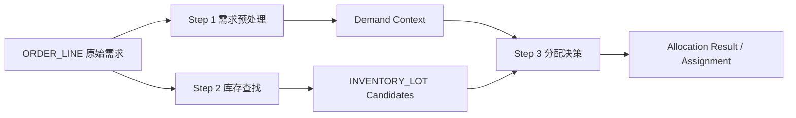

#### 步骤拆解

1. Step 1：需求预处理
- 主输入主体：`ORDER_LINE`
- 输出主体：`ORDER_LINE`
- 作用：
  - 识别真实补货需求
  - 标记优先级、波次、门店友好度、陈列约束
  - 形成后续分配可直接使用的 demand context

2. Step 2：库存查找
- 主输入主体：`ORDER_LINE`
- 输出主体：`INVENTORY_LOT`
- 作用：
  - 根据 SKU、货主、温区、库龄、批次等约束查找可用库存
  - 产出可选库存批次集合

3. Step 3：分配决策
- 主输入主体：`ORDER_LINE`
- 上游依赖输入：
  - 来自 Step 1 的需求上下文
  - 来自 Step 2 的库存候选集
- 输出主体：`LOCATION` / `ASSIGNMENT`
- 动作：`ASSIGN`
- 作用：
  - 结合需求优先级与库存候选
  - 按 FEFO、动线、门店友好度、整零偏好等因子综合评分
  - 输出最终分配结果

#### 推荐建模示例

```ts
const allocationSteps: RuleStep[] = [
  {
    id: 'step_demand_prepare',
    name: '需求预处理',
    stepType: 'FILTER',
    inputSubject: 'ORDER_LINE',
    outputSubject: 'ORDER_LINE',
    action: 'VALIDATE',
    filters: [
      { id: 'f1', field: 'needQty', operator: '>', value: '0' },
      { id: 'f2', field: 'storeStatus', operator: '==', value: 'ACTIVE' }
    ],
    sorters: [],
    failoverAction: 'NEXT_STEP',
    flowControl: 'CONTINUE',
    config: {
      demandBucket: 'STORE_REPLENISHMENT',
      priorityPolicy: 'STORE_PRIORITY_FIRST'
    }
  },
  {
    id: 'step_inventory_lookup',
    name: '库存查找',
    stepType: 'SELECT',
    inputSubject: 'ORDER_LINE',
    outputSubject: 'INVENTORY_LOT',
    action: 'SELECT',
    filters: [
      { id: 'f3', field: 'tempZoneMatch', operator: '==', value: 'true' },
      { id: 'f4', field: 'availableQty', operator: '>', value: '0' }
    ],
    sorters: [
      { factorId: 'factor_fefo', factorName: 'FEFO', weight: 60, direction: 'ASC' },
      { factorId: 'factor_lot_stability', factorName: '批次稳定性', weight: 40, direction: 'DESC' }
    ],
    selectionMode: 'ALL_MATCHED',
    failoverAction: 'ERROR_SUSPEND',
    flowControl: 'CONTINUE'
  },
  {
    id: 'step_allocate',
    name: '综合分配决策',
    stepType: 'SELECT',
    inputSubject: 'ORDER_LINE',
    upstreamBindings: [
      {
        stepId: 'step_demand_prepare',
        alias: 'demandContext',
        subject: 'ORDER_LINE',
        required: true,
        mode: 'LIST'
      },
      {
        stepId: 'step_inventory_lookup',
        alias: 'inventoryCandidates',
        subject: 'INVENTORY_LOT',
        required: true,
        mode: 'LIST'
      }
    ],
    outputSubject: 'LOCATION',
    action: 'ASSIGN',
    filters: [],
    sorters: [
      { factorId: 'factor_fefo', factorName: 'FEFO', weight: 35, direction: 'ASC' },
      { factorId: 'factor_route_distance', factorName: '动线距离', weight: 25, direction: 'ASC' },
      { factorId: 'factor_store_friendly', factorName: '门店友好度', weight: 20, direction: 'DESC' },
      { factorId: 'factor_case_preference', factorName: '整零偏好', weight: 20, direction: 'DESC' }
    ],
    selectionMode: 'ONE',
    failoverAction: 'SPLIT_NEW_WO',
    flowControl: 'TERMINATE',
    config: {
      allowSplitAllocation: true,
      forceAssignWhenShort: false,
      assignmentPolicy: 'BALANCED_FEFO'
    }
  }
];
```

#### 这个案例说明了什么

这个案例的重点不是“Step 3 有很多输入主体”，而是：
- Step 3 仍然有一个明确主输入主体：`ORDER_LINE`
- 但它还依赖两个前序步骤的输出结果
- 一个依赖输出扮演需求上下文角色
- 一个依赖输出扮演库存候选角色
- 最终当前步骤在这些输入基础上做综合决策并执行分配动作

因此，分配类场景最适合用：
- `inputSubject` 表达主处理对象
- `upstreamBindings` 表达前序结果依赖
- `outputSubject` 表达本步产出对象
- `action` 表达最终业务动作

### 9.0.8 对象迁移示意图

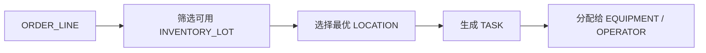

这类链路说明：
- 输入对象和输出对象并不恒定
- 每一步不只是在“算分”，还在“改变处理对象”
- 行为发生在输出对象之上，而不应混在筛选逻辑里

### 9.0.9 推荐的产品交互方式

在步骤配置界面中，建议将单个步骤拆成三个区块：

1. 主体区块
   - 输入主体
   - 输出主体

2. 决策区块
   - 过滤条件
   - 评分因子
   - 排序方向
   - 选择模式
   - 映射规则

3. 行为区块
   - 动作类型
   - 动作参数
   - 流控
   - 失败兜底

这样用户会更容易理解一个步骤真正表达的是：
“针对谁，通过什么规则，选出谁，然后做什么。”

### 9.0.10 行业实践建议

行业里更成熟的做法，通常不是“规则直接输出最终动作”，而是分成三层：

1. Decision：决定谁可选、谁最优、是否允许继续
2. Transformation：把输入对象转换成业务中的下一个对象
3. Command / Action：输出明确的业务动作

因此，推荐的长期方向不是：
- 规则 -> 结果

而是：
- 规则 -> 决策结果 -> 业务动作

这种方式更适合：
- 后端执行引擎实现
- 审计日志记录
- 影子模式回放
- KPI 差异归因
- 复杂动作链路编排

### 9.0.11 推荐的实施顺序

建议按以下顺序落地，而不是一次性做成独立动作节点系统：

第一步：扩展数据模型
- 增加 `stepType`
- 增加 `inputSubject`
- 增加 `outputSubject`
- 增加 `action`

第二步：调整 Editor 的步骤配置结构
- 主体
- 决策
- 行为

第三步：继续强化统一 Step 模型的交互与执行表达
- 让不同决策方式在界面上有清晰差异
- 让 `action` 在所有步骤类型中都能直观配置
- 如未来编排复杂度显著提升，再评估是否需要更细粒度节点体系

### 9.0.12 最终建议

对于这套系统，推荐的方向不是简单增加一个“动作节点”概念，而是把 Step 升级为：

一个同时表达输入主体、输出主体、决策方式和动作行为的统一决策单元。

如果未来流程复杂度继续提升，再从统一 Step 模型自然演进到更细粒度的节点体系。

### 9.1 策略生命周期图

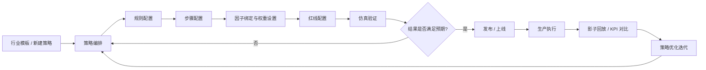

### 9.2 从配置到执行的闭环图

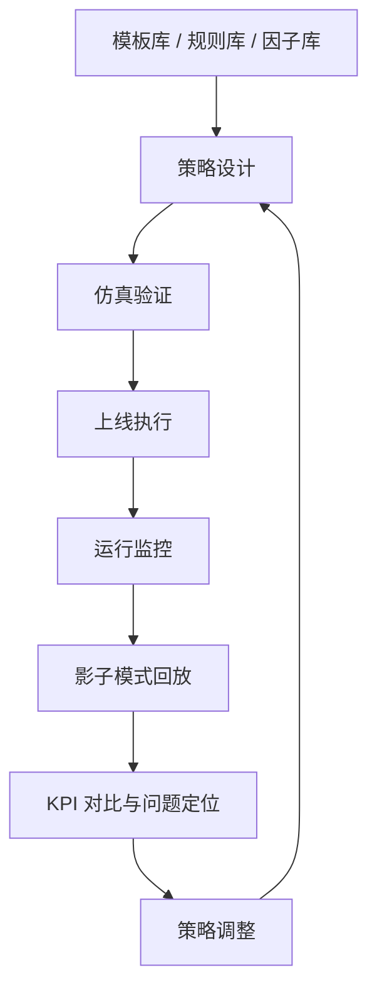

后续无论做交互优化、类型收敛、后端引擎对接还是规则模型扩展，都建议遵循以下原则：

### 9.1 不要把系统简化为单层规则表

策略、规则、步骤、因子、红线是不同层级的对象，职责必须分清。

### 9.2 Step 必须保留执行语义

Step 不是纯展示层概念，而是业务执行阶段的实际承载体。

### 9.3 Factor 必须作为核心资产管理

因子不是表单字段补充，而是整个系统实现评分、解释和复用的基础。

### 9.4 Guardrail 必须高优先级处理

红线类约束不能被局部优选逻辑覆盖。

### 9.5 模拟器应尽量贴近真实执行视角

仿真结果应体现：
- 红线是否命中
- 规则是否命中
- 每一步过滤掉了多少候选
- 排序因子如何生效
- 为什么最终推荐的是当前结果

### 9.6 模板、规则库、因子库必须共享同一套抽象模型

它们只是不同入口，底层语义不应分裂。

## 10. 一句话总结

这套系统的本质是：

一套面向大型复杂仓库的、支持红线拦截、规则编排、步骤执行、因子评分、条件分支与仿真验证的混合模式策略决策平台。
